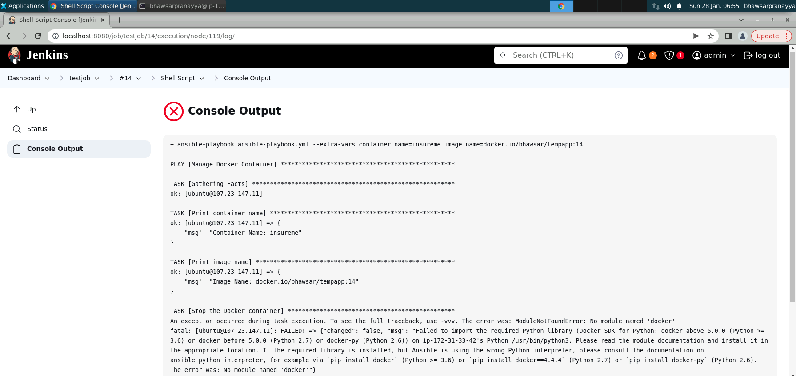

# **ASI Insurance (Capstone Project as part of PG DevOps Program by CalTech delivered by Simplilearn)**

**Objective**: To create a micro-service application architecture for an insurance company through DevOps pipeline and deployment on Docker.

**Problem Statement**

ASI Insurance is facing challenges in improving the SLA to its customers due to its organizational growth and existing monolithic application architecture. It requires transformation of the existing architecture to a microservice application architecture, while also implementing DevOps pipeline and automations. 

The successful completion of the project will enable ASI Insurance to improve its overall application deployment process, enhance system scalability, and deliver better products and services to its customers.

**Task (Activities)**

1. Create the Dockerfile, Jenkinsfile, Ansible playbook, and the source file of the static website. 
2. Upload all the created files to GitHub. 
3. Go to the terminal and install NodeJS. 
4. Open the browser and access the Jenkins application.
5. Create Jenkins pipeline to perform CI/CD for a Docker container. 
6. Create Docker Hub Credentials and other necessary pre-requisites before running build.
7. Set up Docker remote host on AWS and configure deploy stage in pipeline. 
8. Execute Jenkins Build. 
9. Access deployed application on Docker container.

**Tools to use:**

1. Jenkins
2. Github
3. Docker Hub
4. Amazon Web Services

### **Steps:**

## **Machines Used:**
I have used Linux VM provided by Simplilearn Lab as my Jenkins Host and EC2 instance as my target machine for deployment of ASI Insurance applications.

## **1. Create Github Repository:**

Created GitHub Repository at https://github.com/pbhawsar/CapstoneProject.git and uploaded all the required source files.

This Repository contains all the source code, source files for ASI Insurance app, Dockerfile, Jenkinsfile, Ansible playbook etc.

## **2. Install NodeJS**
Checked the presence of NodeJS on my Jenkins Server host, it was not installed so I installed by following steps.

`curl -s https://deb.nodesource.com/setup\_18.x | sudo bash`
`sudo apt install nodejs -y`

Checked NodeJS installation by running.

`node -v`


## **3. Setup Jenkins Host:**
I used Simplilearn lab VM which already had Jenkins installed and accessible on `localhost:8080`.
However the Jenkins was an old version, hence I updated it.

I downloaded the latest Jenkins.war file and followed the steps as listed below:

```
#on ubuntu, in /usr/share/java:

sudo service jenkins stop
sudo mv jenkins.war jenkins.war.old
sudo wget https://updates.jenkins-ci.org/latest/jenkins.war
sudo service jenkins start
```


## **4. Create Jenkins pipeline for Docker Container:**
I created a declarative jenkins pipeline project named `testjob`.

Jenkinsfile link: <https://github.com/pbhawsar/CapstoneProject/blob/main/Jenkinsfile>

I tested the job and faced issues, which I fixed one by one. 


Firstly, I generated github classic token by following steps: <https://docs.github.com/en/authentication/keeping-your-account-and-data-secure/managing-your-personal-access-tokens#creating-a-personal-access-token-classic>

And then generated docker hub token by following steps: <https://docs.docker.com/security/for-developers/access-tokens/>


I setup the GitHub token and Docker Hub token in Jenkins global credentials configuration so I can use it in my pipeline job.


I setup Maven in tools configuration of Jenkins.


I used pipleline syntax generator to create steps,

Started with a cleanup workspace so each job run with a fresh workspace.
Checkout the code from github repo.

```
 tools{
        maven 'Maven'
    }
    stages {
        
        stage('Cleanup') {
            steps {
                // Cleans the workspace on the current node/agent
                cleanWs()
            }
        }
        
        stage('Checkout') {
            steps {
                // Checkout the git repo
               checkout scmGit(branches: [[name: '*/main']], extensions: [], userRemoteConfigs: [[credentialsId: 'GITHUB_ACCESS_TOKEN', url: 'https://github.com/pbhawsar/CapstoneProject.git']])
            }
        }
        
```

Build steps which used Maven tool to generate target directory with generated jar file.

```
 stage('Build') {
            steps {
                // Maven build
                 sh 'mvn clean install'
            }
        }
```

Docker image generation and pushing the image to docker hub, I used build number appended to image name as a tag so each run will have a new image tag, docker login via docker hub token, pushing generated image to docker hub, docker logout so docker hub token is not stored on jenkins server, followed by docker image cleanup from jenkins server.

Dockerfile link: <https://github.com/pbhawsar/CapstoneProject/blob/main/Dockerfile>

```
stage('Push Docker Image to DockerHub') {
            steps{
                script {
                    // Login to docker hub and push docker image 
                    withCredentials([string(credentialsId: 'DOCKER_HUB_TOKEN', variable: 'DOCKER_HUB_PWD')]) {
                     sh 'docker login -u bhawsar -p ${DOCKER_HUB_PWD}'
                     sh 'docker push bhawsar/tempapp:${BUILD_NUMBER}'
                    }
                }
            }
        }
        
        stage('Docker logout') {
            steps{
                script {
                    // Logout of docker hub
                    sh 'docker logout'
                }
            }
        }
        
        stage('Clean Up Docker Image') {
            steps{
                script {
                    // Delete the docker image
                    sh 'docker rmi bhawsar/tempapp:${BUILD_NUMBER}'
                }
            }
        }
```

## **5. Setup Docker Remote host on EC2 instance:**

I setup an EC2 instance with Ubuntu 22.04, I setup the instance with default configuration.
I did update the inbound rules to add the port 8081, so we can access the ASI insurance application when we deploy it which runs on port 8081.


I installed docker on this EC2 instance by following below steps:

`sudo apt update && sudo apt upgrade -y`

Now we install the packages, keys, required repositories:
```
sudo apt install ca-certificates curl gnupg lsb-release

sudo mkdir -p /etc/apt/keyrings

curl -fsSL https://download.docker.com/linux/ubuntu/gpg | sudo gpg --dearmor -o /etc/apt/keyrings/docker.gpg

echo "deb [arch=$(dpkg --print-architecture) signed-by=/etc/apt/keyrings/docker.gpg] https://download.docker.com/linux/ubuntu $(lsb\_release -cs) stable" | sudo tee /etc/apt/sources.list.d/docker.list > /dev/null
```

`sudo apt update`

Now install the docker ce:

`sudo apt-get install docker-ce docker-ce-cli containerd.io docker-buildx-plugin docker-compose-plugin`

Now check the docker version:

`docker -v`

Docker was not running so I did the following:

`sudo service docker start`

`sudo service docker status`

Then you can add your user for docker group

`sudo usermod -aG docker $USER`

Then reload the session

 `newgrp docker`

After this I had to setup Jenkins Server host connectivity to this EC2 instance via ansible.

I had to generate ssh key using `ssh-keygen` command on Jenkins server host and then copying the `id_rsa.pub` key to `authorized_keys` on target EC2 instance.


## **6. Ansible setup on Jenkins server host:**

Ansible was pre-installed on Jenkins server host machine.

I updated the ansible host file with EC2 instance configuration.

`sudo vi /etc/ansible/hosts`

```
[docker]
ubuntu@107.23.147.11

```


Verified connectivity by using ping module 

```
ansible -m ping all

```


After this setup I tried ansible playbook script locally first, I had to install `community.docker` collection, as this playbook uses modules from that collection.I installed it using `ansible-galaxy collection install community.docker`.

Ansible playbook link: https://github.com/pbhawsar/CapstoneProject/blob/main/ansible-playbook.yml

Locally tested running ansible playbook `ansible-playbook ansible-playbook.yml --extra-vars "container_name=insureme image_name=docker.io/bhawsar/tempapp:8`

Now I started with ansible step in Jenkins pipeline,

```
  stage('Execute Ansible Playbook'){
            steps{
               script {
                   // Ansible playbook to depoy the docker image on EC2 instance 
                   sh 'ansible-playbook ansible-playbook.yml --extra-vars "container_name=insureme image_name=docker.io/bhawsar/tempapp:${BUILD_NUMBER}"'
               }
            }
        }
```

This step failed ! and so I had to add the Jenkins `id_rsa.pub` key to EC2 instance `authorized_keys` file.


EC2 Instance `authorized_keys` entry. At this point all the connectivity issues were sorted.


After this step I hit another error as below 

```
An exception occurred during task execution. To see the full traceback, use -vvv. The error was: ModuleNotFoundError: No module named 'docker'
fatal: [ubuntu@107.23.147.11]: FAILED! => {"changed": false, "msg": "Failed to import the required Python library (Docker SDK for Python: docker above 5.0.0 (Python >= 3.6) or docker before 5.0.0 (Python 2.7) or docker-py (Python 2.6)) on ip-172-31-33-42's Python /usr/bin/python3. Please read the module documentation and install it in the appropriate location. If the required library is installed, but Ansible is using the wrong Python interpreter, please consult the documentation on ansible_python_interpreter, for example via `pip install docker` (Python >= 3.6) or `pip install docker==4.4.4` (Python 2.7) or `pip install docker-py` (Python 2.6). The error was: No module named 'docker'"}
```


To fix this error I had to install docker module via python on EC2 instance as below

`sudo apt-get install python3-docker`

## **7. Execute Jenkins pipeline:**

After all the Jenkins pipeline steps were fixed, Jenkins job ran successfully. At each run it would do the following:
 
1. cleanup the workspace.
2. checkout the git repository.
3. maven build.
4. build a docker image with name `bhawsar:tempapp` with a different tag name derived from build number appended to image name.
5. push the built image to docker hub.
6. delete the image from jenkins server host.
7. execute the ansible playbook, which would deploy this image on EC2 instance and start the container with latest image each run.


I could verify the image in docker hub.


I could veriy launching ASI insurance application on my browser.

`107.23.147.11:8081`


